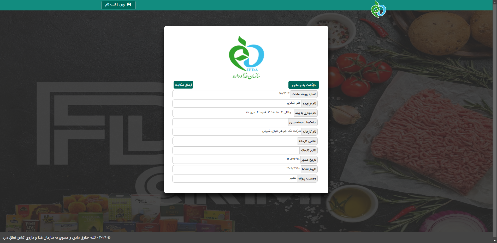
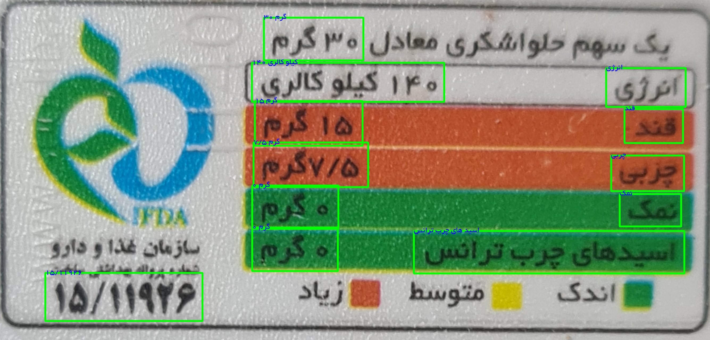

# Food Product Information Extraction using Computer vision

This project focuses on extracting nutritional information and technical details from food product images, utilizing machine learning models such as YOLOv8 and OCR (Optical Character Recognition) techniques. The system aims to help consumers make informed choices by providing easy access to detailed product information, including nutritional facts, technical product details, and activity-related calorie burn estimates. This project is completed for the thesis of my bachelor's degree and you can read the full thesis [here](https://github.com/Ali-Pourgheysari/Iranian-nutrition-fact-scanner-and-analyzer/blob/main/Documents/Thesis.pdf).

## Overview

In today’s fast-paced world, there is an increasing need for consumers to quickly and accurately access nutritional and technical information about food products. This project aims to tackle this issue by using advanced machine learning techniques for detecting food product labels and extracting key information, including calories, nutritional values, and more.

### Key Objectives:
- **Label Detection**: Identify and extract product labels from images.
- **Text Recognition (OCR)**: Read and interpret nutritional values and other information from the product labels.
- **Calorie Analysis**: Calculate calorie expenditure for different physical activities based on the extracted energy values from food products.
- **Get Additional Product Details**: Fetch additional product information such as manufacturer details using web scraping techniques.

## Installation

1. Clone the repository:
    ```bash
    git clone https://github.com/Ali-Pourgheysari/Iranian-nutrition-fact-scanner-and-analyzer.git
    ```
2. Install the required dependencies:
    ```bash
    pip install -r requirements.txt
    ```
3. Download necessary models from this link: [Models](https://www.kaggle.com/models/gheysar4real/nutritional-label-scanner)
4. Copy the downloaded models to the `Models` directory in the project folder.
5. You can also access the dataset used for training the models from this link: [Dataset](https://www.kaggle.com/datasets/gheysar4real/iranian-nutritional-fact-label)

## Usage

* Run the main script to start the application:
    ```bash
    python Inference.py
    ```

## Models

### YOLOv8 for Label Detection
YOLOv8 is used for detecting product labels in images. Its lightweight architecture allows for real-time performance while maintaining high accuracy in object detection tasks.

### CRAFT for Text Detection
CRAFT (Character Region Awareness for Text Detection) is used to detect text regions in images. This model is capable of detecting text of various sizes and orientations, making it suitable for extracting information from product labels.

### TPS-ResNet-BiLSTM-Attn for OCR
A combination of TPS (Thin Plate Spline) for spatial transformation, ResNet for feature extraction, BiLSTM for sequence modeling, and an attention mechanism is employed to recognize text from product labels.

## Data Augmentation

Data augmentation techniques, such as rotation, scaling, and brightness adjustments, were applied to increase the diversity of the training data. This helped improve the robustness of the models in various lighting and orientation conditions.

## Evaluation

The models were evaluated using key metrics such as accuracy, precision, recall, H-mean, and normalized edit distance (NED). The evaluation was conducted on a test set comprising 20% of the entire dataset.

## Results

The system showed high performance in both label detection and text recognition tasks:
- **YOLOv8 Performance**:
  - Precision: 99%
  - Recall: 99%

- **CRAFT Performance**:
  - Precision: 96.1%
  - Recall: 92%
  - H-mean: 94%

- **TPS-ResNet-BiLSTM-Attn**:
  - Accuracy: 88.5%
  - NED: 96.9%

you can see the results of the project in the following images:
  

## Improvements

Several improvements could be made to the system:
- **Dataset Expansion**: Increasing the diversity of the training data could help improve the models' performance on a wider range of products.
- **Data Augmentation**: Applying more advanced data augmentation techniques could further enhance the models' robustness.
- **Fine-tuning Models**: Fine-tuning the models on specific product categories could enhance their accuracy for different types of food products.
- **Multi-lingual Support**: Adding support for multiple languages on product labels could make the system more versatile and accessible to a wider audience.
- **Skew Correction**: Implementing skew correction techniques could help improve the accuracy of text recognition on tilted labels.
- **Ensemble Models**: Combining multiple models for label detection and text recognition could further boost the system's performance.
- **Real-time Processing**: Optimizing the models for real-time processing could make the system more user-friendly and efficient.
- **Web or Mobile Application**: Developing a web or mobile application for easy access to the system could enhance its usability and reach.
- **More Analysis Features**: Adding more features for analyzing nutritional information, such as ingredient and color analysis could provide users with comprehensive product insights.
